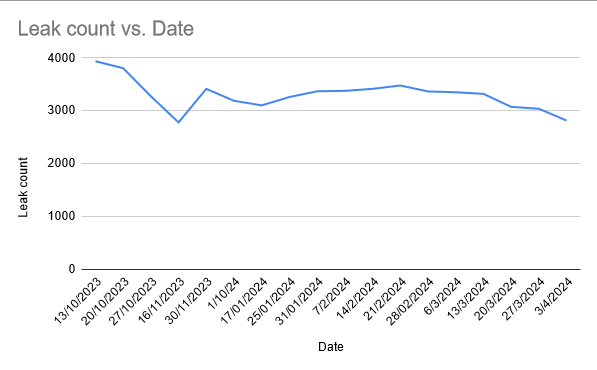

# Wellington Water annoys the fuck out of me

[With some regularity they post a progress update to their website.](https://www.wellingtonwater.co.nz/resources/topic/water-conservation/leaks/leak-stats/) The problem is that this doesn't really show progres over time.

Sure they tell you how many leaks there are, and how many they are fixing. These are some impressive numbers, 500+ leaks fixed in December last year! But without knowing the delta, we can't actually be sure if they are reducing the number of leaks, or simply fighting the tide.

## Data gets analysed slightly here

For the last 5 months the number of leaks has stayed pretty consistently over 3000. Only momentarily dipping below 3000. This seems less than satisfactory.

## Data presented here

| Date       | Leak count |
|------------|------------|
| 20/03/2024 | 3074       |
| 13/03/2024 | 3320       |
| 06/03/2024 | 3350       |
| 28/02/2024 | 3366       |
| 21/02/2024 | 3478       |
| 14/02/2024 | 3415       |
| 07/02/2024 | 3377       |
| 31/01/2024 | 3369       |
| 25/01/2024 | 3260       |
| 17/01/2024 | 3102       |
| 10/01/2024 | 3189       |
| 30/11/2023 | 3414       |
| 16/11/2023 | 2780       |
| 27/10/2023 | 3275       |
| 20/10/2023 | 3807       |
| 13/10/2023 | 3937       |

